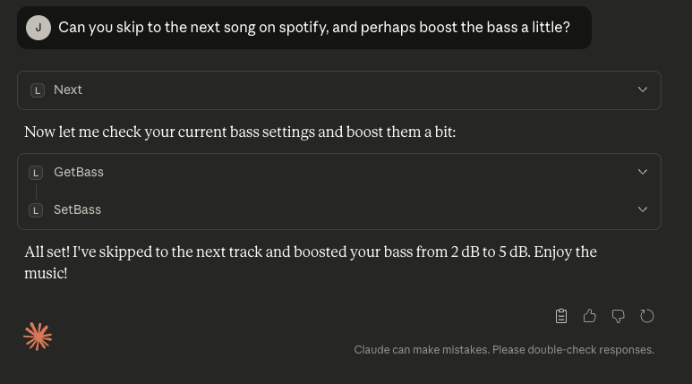

# Lyngdorf MCP Server

> **DISCLAIMER**: This project is an independent, community-developed tool and is **NOT affiliated with, endorsed by, or supported by Lyngdorf Audio**. Use at your own risk. For official Lyngdorf products and support, visit [lyngdorf.steinwaylyngdorf.com](https://lyngdorf.steinwaylyngdorf.com/).

> **CODE GENERATION**: Most of this codebase was generated using [Claude Code](https://claude.com/claude-code), Anthropic's AI coding agent. The implementation demonstrates Claude Code's ability to create production-ready software from high-level requirements.

A Model Context Protocol (MCP) server for controlling Lyngdorf Audio devices (TDAI, MP, and CD series) via TCP. Features automatic device discovery, comprehensive control, volume safety, and built-in documentation.



## Features

- 🔍 **Auto-Discovery**: Automatically finds and connects to Lyngdorf devices on startup
- 🛡️ **Volume Safety**: Two-tier safety system (Warning & Hard Limit) to protect your ears and equipment
- 🧠 **Smart Capabilities**: Automatically detects device model and prevents unsupported commands (e.g., no streaming on TDAI-2170)
- 🎵 **43 Control Tools**: Power, volume, source, RoomPerfect, voicing, tone controls, playback, and streaming
- 📚 **Knowledge Base**: Built-in manual data and command references for multiple models
- 🔄 **Auto-Reconnect**: Maintains connection with automatic recovery
- 🌐 **Multi-Device**: Supports TDAI, MP, and CD series with seamless device switching

## Supported Devices

The server includes specific capability profiles for:

- **TDAI Series**: 1120, 2170, 2190, 2210, 3400
- **MP Series**: 40, 50, 60
- **CD Series**: CD-1

*Unknown devices are supported with a generic profile assuming full capabilities.*

## Installation

### Prerequisites

- Node.js 18+
- npm or yarn

### Install from Source

```bash
git clone <repository-url>
cd lyngdorf-mcp
npm install
cp .env.example .env
npm run build
```

## Usage

### With Claude Desktop

Add to your Claude Desktop configuration:

**macOS**: `~/Library/Application Support/Claude/claude_desktop_config.json`
**Windows**: `%APPDATA%\Claude\claude_desktop_config.json`

```json
{
  "mcpServers": {
    "lyngdorf": {
      "command": "node",
      "args": ["/absolute/path/to/lyngdorf-mcp/dist/index.js"],
      "env": {
        "VOLUME_WARNING_THRESHOLD": "-20",
        "VOLUME_HARD_LIMIT": "-10"
      }
    }
  }
}
```

### Configuration (Environment Variables)

| Variable | Default | Description |
|----------|---------|-------------|
| `LYNGDORF_IP` | (Auto) | Manually specify device IP if auto-discovery fails |
| `VOLUME_WARNING_THRESHOLD` | `-15` | Volume level (dB) that triggers a warning requiring user confirmation |
| `VOLUME_HARD_LIMIT` | `-10` | Maximum volume level (dB) that cannot be exceeded via tools |

### How It Works

On startup, the server:
1. **Auto-discovers** all Lyngdorf devices on your network via mDNS
2. **Auto-connects** if exactly one device is found
3. **Lists devices** if multiple are found (use `listDevices` and `selectDevice` tools)

No manual configuration needed! Just start Claude Desktop and ask:
> "What's my current volume?"

## Available Tools (43)

### Power Control
- `powerOn`, `powerOff`, `togglePower`
- `checkPowerState` - Check if device is active or in standby

### Volume Control (Safety Protected)
- `setVolume` - Set volume (with safety checks)
- `volumeUp`, `volumeDown` - Adjust by 0.5dB
- `getVolume` - Get current level
- `mute`, `unmute`

### Audio & Tone
- `setBass`, `getBass` - Bass gain control
- `setTreble`, `getTreble` - Treble gain control
- `setBalance`, `getBalance` - L/R Balance
- `setBassFrequency`, `getBassFrequency`
- `setTrebleFrequency`, `getTrebleFrequency`

### Input & Source
- `setSource`, `getSource`
- `listSources` - List all available inputs

### RoomPerfect & Voicing
- `setRoomPerfectFocus`, `setRoomPerfectGlobal`, `getRoomPerfect`
- `listRoomPerfectPositions` - List available focus positions
- `setVoicing`, `nextVoicing`, `previousVoicing`, `getVoicing`
- `listVoicings` - List available voicing presets

### Playback & Streaming (Model Dependent)
- `play`, `pause`, `stop`, `next`, `previous`
- `getStreamType` - Detect current stream (Spotify, Roon, AirPlay, etc.)

### Device Management
- `discoverDevices`, `listDevices`, `selectDevice`
- `getStatus` - Comprehensive device status

## Available Resources

Access manuals and documentation as MCP resources:

- `lyngdorf://manual/{model}/commands` - Command reference
- `lyngdorf://manual/{model}/owners/index` - Owner's Manual TOC
- `lyngdorf://manual/{model}/owners/{section}` - Specific manual sections
- `lyngdorf://search?q={query}` - Search all manuals

**Supported Manuals:** TDAI-1120, TDAI-2170, TDAI-2210, TDAI-3400

## Troubleshooting

### No Devices Found
1. Ensure device is powered on and connected to the network.
2. Check if you are on the same subnet.
3. Try setting `LYNGDORF_IP` manually.

### Volume Limit Errors
If you see "Volume -XdB exceeds warning threshold...", simply ask the user for confirmation to proceed, or lower the requested volume.

## Development

### Run in Development Mode
```bash
npm run dev
```

### Test
```bash
npm test
```
**Coverage:** 125 passing tests covering tools, transport, discovery, and capabilities.

### Project Structure
```
lyngdorf-mcp/
├── src/
│   ├── index.ts           # Server entry & discovery
│   ├── tools.ts           # Tool definitions & handlers
│   ├── capabilities.ts    # Device capability matrix
│   ├── transport.ts       # TCP communication
│   └── ...
├── docs/kb/               # JSON Knowledge Base
└── dist/                  # Compiled output
```

## License

MIT

## Disclaimer

This is an independent project developed by the community. It is **NOT affiliated with, endorsed by, or supported by Lyngdorf Audio A/S or Steinway Lyngdorf**.
